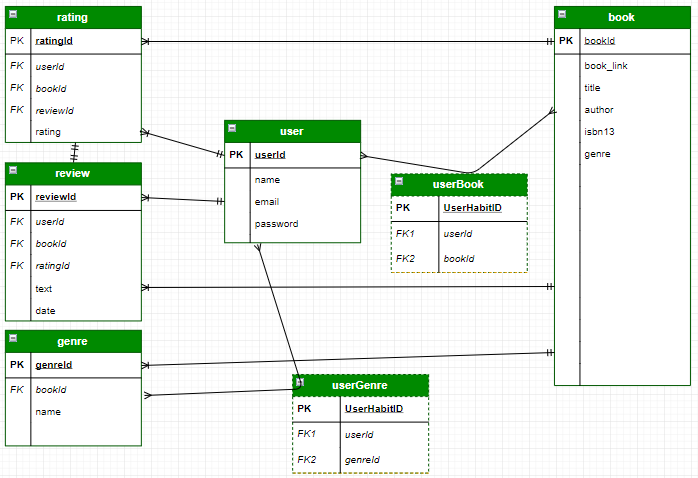
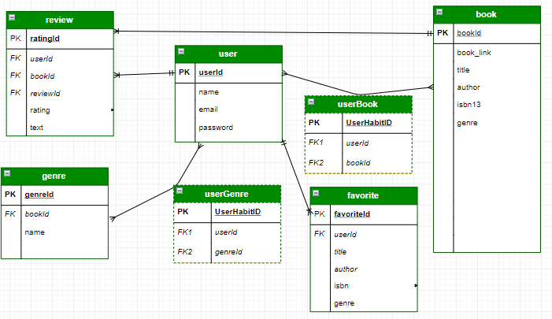

# nextbook
nextbook is a full CRUD app used to recommend the next book for a user. Users can pick genres of interest, as well as rate and review books they've already read. This will then populate their recommended books. From there users can add books to their favorites.

## Getting Started

### Objective
To create a full-stack Node application using Express that pulls information about a user’s books, allows them to rate and review their books, and recommends the user to similar books. 

### Goals include:
* [x] Including 2+ models
* [x] Include sign up/log in functionality, with hashed passwords & an authorization flow
* [x] Incorporate at least one API
* [x] Have complete RESTful routes
* [x] Utilize an ORM (Sequelize) to create a database table structure and interact with your relationally-stored data
* [x] Include wireframes that you designed during the planning process.

### Wireframes
Initial wireframes and prototyping of Mobile and Desktop views can be found [here](https://wireframe.cc/xpkjEJ)

### Trello Board
View the project Trello Board [here](https://trello.com/b/YBlxEvyb/nextbook)

### ERD (Entity Relationship Diagram)
My first Draft – I ended up over-complicating some portions of this (the book didn’t need many genre’s since only the user would be using them in the recommendation engine, also I could combine rating and review).

  

Believe it or not there were quite a few more revisions to my tables, as evidenced by my migrations folder. I won’t share those here for the sake of brevity.
The final draft of my ERD is shown here:

  

[ERD Diagram Link](https://www.draw.io/?client=1&page=1#W28ebc226bc8a6f7c%2F28EBC226BC8A6F7C!14634)

### APIs
Google books API
GoodReads API: (I ended up not using this API because it lacked search functionality, however, if given permission it does have a nice way of generating lists based on users preferences. Goodreads, unfortunately, never got back to me about gaining permission to access this portion of the API.

### Resources and Libraries used
*	async: "^2.6.2",
*	bcrypt: ^3.0.4,
*	bootstrap-select: ^1.13.6,
*	connect-flash: ^0.1.1,
*	connect-session-sequelize: ^6.0.0,
*	dotenv: ^6.2.0,
*	ejs: ^2.6.1,
*	express: ^4.16.4,
*	express-ejs-layouts: ^2.5.0,
*	express-session: ^1.15.6,
*	helmet: ^3.15.1,
*	lodash: ^4.17.11,
*	method-override: ^3.0.0,
*	morgan: ^1.9.1,
*	passport: ^0.4.0,
*	passport-local: ^1.0.0,
*	pg: ^7.8.1,
*	request: ^2.88.0,
*	sequelize: ^4.42.1,
*	sequelize-cli: ^5.4.0,
*	xmldom: ^0.1.27,
*	xmltojson: ^1.3.5NodeJS

for more information on packages used, please review package.json

### Models and Relations
Model	Schema	Relation


### Routes in use
| METHOD | ROUTE |
|--------|-------|
| GET	|   /auth/signup |
| GET	|   /auth/login |
| POST |  /auth/signup |
| POST	| /auth/login |
| GET	|   /auth/logout |
| GET |   /favorite/index |
| POST |  /favorites |
| DELETE | /favorite |
| GET |   /genres/index |
| POST | /genres |
| DELETE | /genres |
| GET | /main/index |
| GET | /mybooks/index |
| GET | /mybooks/new |
| POST | /mybooks |
| GET | /mybooks/edit |
| PUT | /mybooks |
| DELETE | /mybooks |
| GET | /search/new |
| GET | /search/show |
| GET | / |

### Authentication Boilerplate
I started with an authentication boilerplate using Express authentication template, Passport + flash messages + encryption + custom middleware. Includes routes to log, in signup, and sign out.

## Challenges
### Search functionality:
The first major challenge was implementing the search functionality. I wanted to be able to search by author, title, and category. This meant some tricky API query searches. I ended up having to change the actual URL of the API depending on what I was searching. I used DOM manipulation to display what the user wants to search by, then sent that to the back-end. From there I used conditionals to distinguish what the user wanted to search by and used the corresponding API search. I then rendered the search results on a page, allowing the user to select which book they want to rate and review then add to their mybooks collection.

After selecting a book the user is redirected a page which displays the selected the book, where the user must add a rating and optional review before they can add it to their personal book collection (mybooks).

This was a lot of back-end, behind the scenes work,because the book model is linked to four different models. This involved many revisions of my models (missing columns, foreign keys, new migrations, and on). I ended up removing a table (ratings) combining it with ratings, and changing books to have no relationship with genres. This streamlined my database associations and will make my routes much simpler.

### Sorting Results
The Google Books API had no parameter to order the search results. This was maddening because the if I searched “Harry Potter” I got “The Baptism of Harry Potter – A Christian Reading”, which sounds riveting, but was not what I’m looking for.

Looking at the information coming back from the API, I had to decide what to sort by. This functionality would hopefully come into play for my recommendation engine. I decided to go with the count of ratings. I leveraged ternary’s to change the value of falsey or incorrect string values to zero. Then I used my sort function. I put this on the GET route on the back end to sort the value before it gets displayed.
```
function compare(a, b) {
        if (a.ratingsCount > b.ratingsCount)
          return -1;
        if (a.ratingsCount < b.ratingsCount)
          return 1;
        return 0;
        }
      googleBooks.sort(compare);
```

### Genre’s
I wanted to add functionality where a user could select a genre from a pre-populated list to help build a profile of what the user likes to read which would be used for the recommendation engine. I decided the best way to go about this would be an AJAX call. I wanted a user interface that was clean and responsive that would essentially move a genre you click in from available genres into your selected genres.

### Recommendation Engine
My app had full crud routes by the time I got to my recommendation engine. The idea was that based on the user’s chosen genres and reviewed books, the app could recommend books for the user. Slick right? I knew this would be a challenge. I came back to the same problem of the googleBooks API having a weird search engine that outputted strange results. I found a workaround deep in the googleBooks API notes where you could paginate your queries. This means that regardless of the results I could beat the max 40 results using async, get a ton of results back from the API, then filter them on the back-end. I would base my initial query based on the user’s genres selected, then find out a good way to filter them. I set it up so the URL of the query would have a few variables in it:
```
let url = `https://www.googleapis.com/books/v1/volumes?q=category:${genres[0]}&printType=books&maxResults=40&startIndex=${index}`
```
The index is references from an array containing multiples of 40 (the maximum number of results per query). The larger the array, the more API requests. This was nice because all I had to do was change this array to tweak the number of all results returned. 

```
router.get('/', isLoggedIn, function(req, res) {
  db.user.findById(parseInt(req.user.id), { include: [db.genre] }).then(function (user) {
    let unmappedGenres = user.get({plain: true}).genres;
    genres = unmappedGenres.map( genre => encodeURI(genre.name) );
    return genres;
  }).then(function() {
    const requests = requestIndexes.map(function(index) {
      return function(callback) {
        let url = `https://www.googleapis.com/books/v1/volumes?q=category:${genres[0]}&printType=books&maxResults=40&startIndex=${index}`
        // console.log('url is', url)
        request (url, function(error, res, body) {
          if (JSON.parse(body).items) {
            let googleBooks = JSON.parse(body).items;
            let books = googleBooks.map(function(book) {
              // filters results
              if (book.volumeInfo.industryIdentifiers) {
                if (book.volumeInfo.industryIdentifiers[0].type != 'OTHER') {
                  return {
                    bookLink: (book.selfLink) ? book.selfLink : 'no link',
                    title: (book.volumeInfo.title) ? book.volumeInfo.title : 'no title',
                    author: (book.volumeInfo.authors) ? book.volumeInfo.authors.join(' ') : 'no author',
                    publicationYear: (book.volumeInfo.publishedDate) ? book.volumeInfo.publishedDate.split('-')[0] : 'no publication',
                    description: (book.volumeInfo.description) ? book.volumeInfo.description : 'no description',
                    isbn: (book.volumeInfo.industryIdentifiers) ? book.volumeInfo.industryIdentifiers[0].identifier : 'no isbn',
                    averageRating: (book.volumeInfo.averageRating) ? book.volumeInfo.averageRating : 'no ratings',
                    ratingsCount: (book.volumeInfo.ratingsCount) ? book.volumeInfo.ratingsCount : 0,
                    category: (book.volumeInfo.categories) ? book.volumeInfo.categories.join(' ') : 'no category',
                    imageUrl: (book.volumeInfo.imageLinks) ? book.volumeInfo.imageLinks.thumbnail : 'no image url',
                    previewLink: (book.volumeInfo.previewLink) ? book.volumeInfo.previewLink : 'no preview link',
                    price: (book.saleInfo.retailPrice) ? book.saleInfo.retailPrice.amount : 'not for sale'
                  }
                }
              }
            })
            callback(null, books)
          } else {
            callback(null, [])
          }
        })
      }
    })
    async.parallel(async.reflectAll(requests), function(error, results) {
```

### Filtering Results
The first step in filtering the results from the googleAPI was cleaning up each result. I started with some conditionals because some results were coming back with almost no data in the API. Then I leveraged ternary’s and only outputted the relevant information, and putting it in a neat, organized object.
```
if (JSON.parse(body).items) {
            let googleBooks = JSON.parse(body).items;
            let books = googleBooks.map(function(book) {
              // filters results
              if (book.volumeInfo.industryIdentifiers) {
                if (book.volumeInfo.industryIdentifiers[0].type != 'OTHER') {
                  return {
bookLink: (book.selfLink) ? book.selfLink : 'no link',
title: (book.volumeInfo.title) ? book.volumeInfo.title : 'no title',
author: (book.volumeInfo.authors) ? book.volumeInfo.authors.join(' ') : 'no author',
publicationYear: (book.volumeInfo.publishedDate) ? book.volumeInfo.publishedDate.split('-')[0] : 'no publication',
description: (book.volumeInfo.description) ? book.volumeInfo.description : 'no description',
isbn: (book.volumeInfo.industryIdentifiers) ? book.volumeInfo.industryIdentifiers[0].identifier : 'no isbn',
averageRating: (book.volumeInfo.averageRating) ? book.volumeInfo.averageRating : 'no ratings',
ratingsCount: (book.volumeInfo.ratingsCount) ? book.volumeInfo.ratingsCount : 0,
category: (book.volumeInfo.categories) ? book.volumeInfo.categories.join(' ') : 'no category',
imageUrl: (book.volumeInfo.imageLinks) ? book.volumeInfo.imageLinks.thumbnail : 'no 
previewLink: (book.volumeInfo.previewLink) ? book.volumeInfo.previewLink : 'no preview link',
price: (book.saleInfo.retailPrice) ? book.saleInfo.retailPrice.amount : 'not for sale'
```

After this was done I was left with an array of objects containing an array of objects. AKA I had an array of sets containing 40 books each. I had to get this to be a more manageable array of objects to use on the front end. For this, I employed lodash which added some functions (indicated by the _). I then sorted the results to get the most rated books.
```
let books = _.compact(_.flatten(results.map( r => r.value)))
      
      // sorting the data by popularity
      function compare(a, b) {
        if (a.ratingsCount > b.ratingsCount)
          return -1;
        if (a.ratingsCount < b.ratingsCount)
          return 1;
        return 0;
      }
      books.sort(compare);
```
### heroku deployment
My app was working perfectly when everything was hosted locally, and then everything broke when I deployed the app on Heroku. After hours of searching I found that there was still a column on my reviews table for ratingId. This meant that the app was looking for a relation to a rating table that no longer existed in the database.

## Known Issues
### Recommendation engine
Right now the functionality of the recommendation engine isn’t what I wanted it to be. It’s going strictly on the first genre that the user outputted. My next step is to tie in the goodreads API to then sort by goodreads rating which would be more accurate and have a more robust set of data. I applied to more access to goodreads actual booklists which is a really neat funcitonality of user voted lists based on genres and sub-genres. I never heard back from them (pinging Amazon), but would love to delve into that method of API request.

## Future Releases
* Further builds on recommendation engine, more personalized
* Build user profiles with information of what books they like
* Expand book descriptions, don't display full description from the start
* Value bar at the top for a goals per year of how many books to read
* Page of all users and the books they’ve read to make a community
* User profile to update email/password

@sixhops && @msShull for guidance
nextbook – find your nextbook!
-Owen R. James
